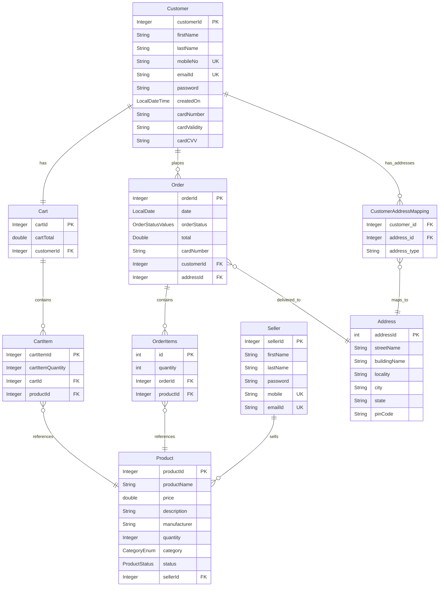

#  E-Commerce Backend API - Spring Boot
This is a fully functional backend API for an E-Commerce platform, built using Spring Boot. The application supports role-based authentication (Customer, Seller), product management, cart operations, order placement, and secure login/logout with JWT tokens.


## Entity Relationship Diagram




### Key Relationships

- **Customer** has one **Cart** (One-to-One)
- **Customer** can place multiple **Orders** (One-to-Many)
- **Customer** has multiple **Addresses** with types via mapping table (Many-to-Many)
- **Cart** contains multiple **CartItems** (One-to-Many)
- **Order** contains multiple **OrderItems** (One-to-Many)
- **Product** can be in multiple **CartItems** and **OrderItems** (Many-to-One)
- **Seller** can sell multiple **Products** (One-to-Many)
- **Address** can be used for multiple **Orders** (One-to-Many)
- **Customer** has embedded **CreditCard** information (Composition)


### Notes

- `PK` = Primary Key
- `FK` = Foreign Key
- `UK` = Unique Key
- CreditCard fields are embedded in Customer table (not shown as separate entity)
- Enums: `OrderStatusValues`, `CategoryEnum`, `ProductStatus`

##  Tech Stack

- **Java 21**
- **Spring Boot**
- **Spring Security**
- **JWT (JSON Web Tokens)**
- **Spring Data JPA**
- **MySQL**
- **Hibernate**
- **Maven**


##  Features

- **User Authentication & Authorization**
  - Role-based login (Customer, Seller)
  - JWT-based secure login and logout
- **Customer Features**
  - Add to cart / remove from cart
  - Place and view orders
- **Seller Features**
  - Add, update, and delete products
  - View own listed products
- **General**
  - Password encryption using BCrypt
  - Exception handling with custom error responses
  - Layered architecture (Controller-Service-Repository)
 

## Running the project locally
- Clone the repository
- Update the application.properties file with your database username and password

  ```spring.datasource.url=jdbc:mysql://localhost:3306/ecommerce
  spring.datasource.username=your_mysql_username
  spring.datasource.password=your_mysql_password```

- Run the project from command line using: .\mvnw spring-boot:run


## Acknowledgments

- Inspired by common e-commerce platforms and Spring Boot architecture
- Thanks to open-source contributors and Spring Boot community for resources and guidance


